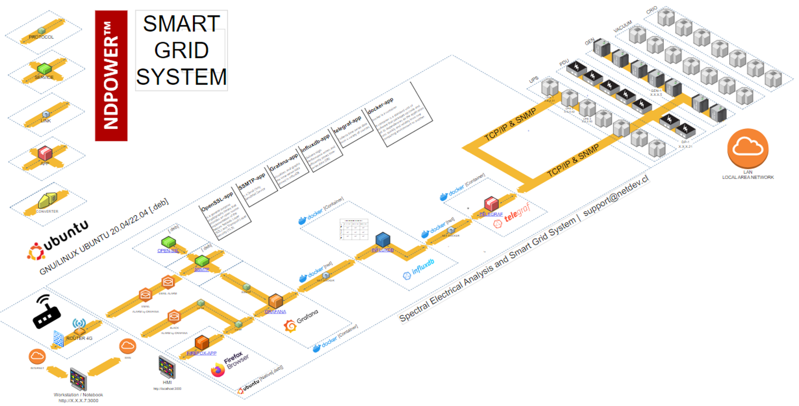

# Conceptos

## PowDevs

Son equipos electrónicos, eléctricos, electromecánicos de diversos fabricantes y tipos (a lo que en la literatura se le llama _multivendor_) desde los cuales se obtiene, mediante protocolos de comunicación digitales, diversas métricas, como de potencia, parámetros eléctricos, frecuencias, etc. que permiten hacer diversos tipos de análisis (como por ejemplo, análisis espectral eléctrico), monitoreo y configuración de alarmas

Generalizando, un _PowDev_ es cualquier dispositivo que genere, almacene, consuma o preocese potencia eléctrica

Ejemplos de PowDev son: generadores, UPS, electromotores, etc.

# Descripción del proyecto

## Esquema general del proyecto

En la imágen a continuación, se encuentra el esquema general del proyecto _Smart Grid_

> Sección en desarrollo. Disculpe las molestias

**[Volver al README](/README.md)**, o ir al [capítulo 2](/Cap2_01_DespliegueApps.md)
