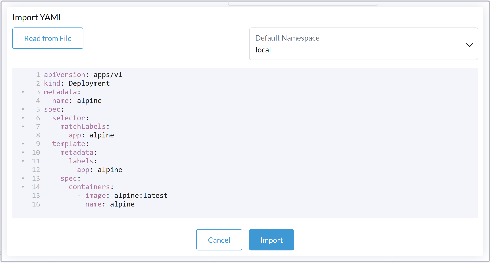

# Despliegue de aplicaciones (Grafana, Influxdb y Telegraf)

A continuación se entregan detalles de como desplegar los _software_ [Grafana](https://grafana.com/), [InfluxDB](https://www.influxdata.com/) y [Telegraf](https://www.influxdata.com/time-series-platform/telegraf/) en el cluster, con sus correspondientes _Secrets_, _PersistentVolumes_ (_PV_), _PersistentVolumeClaims_ (_PVC_) y _Services_.

Antes de comenzar, debemos procurar crear un almacenamiento que nos permita persistir los datos de los despliegues, ya que éstos son de naturaleza efímera y pierden su contenido al ser re-desplegados

## Creación de una Clase Almacenamiento _StorageClass_

En Kubernetes, un _StorageClass_ provee una manera de describir clases de almacenamiento. Diferentes clases podrían tener diferentes características como nivel de calidad de servicio, respaldo, políticas, etc.

En nuestro caso, creamos un _StorageClass_ que ya estaba definido por el cliente en su _cluster_

```yaml
allowVolumeExpansion: true
apiVersion: storage.k8s.io/v1
kind: StorageClass
metadata:
    manager: kubectl-patch
    operation: Update
    time: "2022-04-21T19:04:18Z"
  name: rook-ceph-block
parameters:
  clusterID: rook-ceph
  csi.storage.k8s.io/controller-expand-secret-name: rook-csi-rbd-provisioner
  csi.storage.k8s.io/controller-expand-secret-namespace: rook-ceph
  csi.storage.k8s.io/fstype: ext4
  csi.storage.k8s.io/node-stage-secret-name: rook-csi-rbd-node
  csi.storage.k8s.io/node-stage-secret-namespace: rook-ceph
  csi.storage.k8s.io/provisioner-secret-name: rook-csi-rbd-provisioner
  csi.storage.k8s.io/provisioner-secret-namespace: rook-ceph
  imageFeatures: layering
  imageFormat: "2"
  pool: replicapool
provisioner: rook-ceph.rbd.csi.ceph.com
reclaimPolicy: Delete
volumeBindingMode: Immediate
```

El _script_ YAML puede descargarse [aqui](/yamls/08_servicioGrafana.yaml)

## Enlaces a los despliegues específicos

A continuación, invitamos a revisar en detalle el desliegue de cada aplicación, presentados en orden de dependencia:

1. [Despliegue de Grafana](/Cap2_02_DespliegueGrafana.md)
2. [Despliegue de Influxdb](/Cap2_03_DespliegueInfluxdb.md)
3. [Despliegue de Telegraf](/Cap2_04_DespliegueTelegraf.md)

En cada sección, se presentan el contenido (en aquellos casos que no sea muy extenso) de las declaraciones en formato YAML de los despliegues (_deployments_) y sus recursos dependientes (_PVC_, _Service_ y otros). El usuario podrá cargar rápidamente las declaraciones en formato YAML usando el botón _"Import YAML"_ que se encuentra en la barra superior a la derecha de la interfaz de Rancher en la vista del _cluster_ seleccionado. Para mayor detalle sobre el formato YAML y como cargar las definiciones en Rancher, por favor, revise la sección educativa que se encuentra más abajo en este mismo artículo.

**[Volver al README](/README.md), o ir al [paso 2](/Cap2_02_DespliegueGrafana.md)**

---

## Sección complementaria educativa:

### ¿Qué es un _deployment_?

En Kubernetes, un _deployment_ es una declaración que ordena al _cluster_ a desplegar un _software_ contenedorizado. En la práctica, se define un archivo YAML (que veremos en la siguiente sección) que declara meta información del despliegue, entre ella, nombre, volúmenes, variables de entorno, mapeo de puertos, y, probablemente lo más importante, una imágen de un micro servicio (en nuestro caso, una imágen Docker alojada en Docker Hub) a ser desplegada en uno o más _pods_ de nuestro _cluster_. Rancher, por su parte, permite monitorear los despliegues y conectarse a ellos mediante una consola.

### Uso de YAML

Rancher permite declarar despliegues, volúmenes, secretos, mapeos de configuración y muchos otros recursos, mediante formularios web que facilitan el proceso. Sin embargo, una vez que se domina la herramienta es más rápido y eficiente trabajar directamente con el resultado del formulario: una definción en formato YAML.

> Nota: "YAML es un formato de serialización de datos legible por humanos. Es un acrónimo recursivo que significa _YAML Ain't Markup Language_"(\*). Podría decirse que es una alternativa a XML o JSON más comprensible por las personas.

A continuación, y a modo de ejemplo, desplegaremos una imágen de Alpine, un sistema Linux muy liviano orientado a la seguridad. Su definción como _deploymnent_ en formato YAML es el siguiente:

```yaml
apiVersion: apps/v1
kind: Deployment
metadata:
  name: alpine
spec:
  selector:
    matchLabels:
      app: alpine
  template:
    metadata:
      labels:
        app: alpine
    spec:
      containers:
        - image: alpine:latest
          name: alpine
```

[Descargar](/yamls/01_ejemplo.yaml)

Las entradas clave son:

- _kind_: Indica a Kubernetes que se trata de un despliegue de aplicación. Otras opciones para la entrada _kind_ podrían ser _Secret_, _PersistentVolume_, _DaemonSet_ y otros recursos.
- _image_ (dentro de _containers_) : Indica a Kubernetes la imágen a descargar e inicializar. En nuestro caso, se traduce que imágen de Docker Hub se debe hacer _pull_

El primer botón de la barra superior, como se ve en la imágen a continuación, permite cargar archivos o copiar & pegar texto que respete el formato YAML


En la imágen a continuación, se ve como se puede pegar el texto, asignando un _namespace_ a criterio del usuario



> NOTA: En kubernetes, un _namespace_ es un conjunto abstracto de recursos del _cluster_ que permite mantenerlos en orden

(\*) Basado en el artículo de Wikipedia en español, visitado el 20/12/2022
