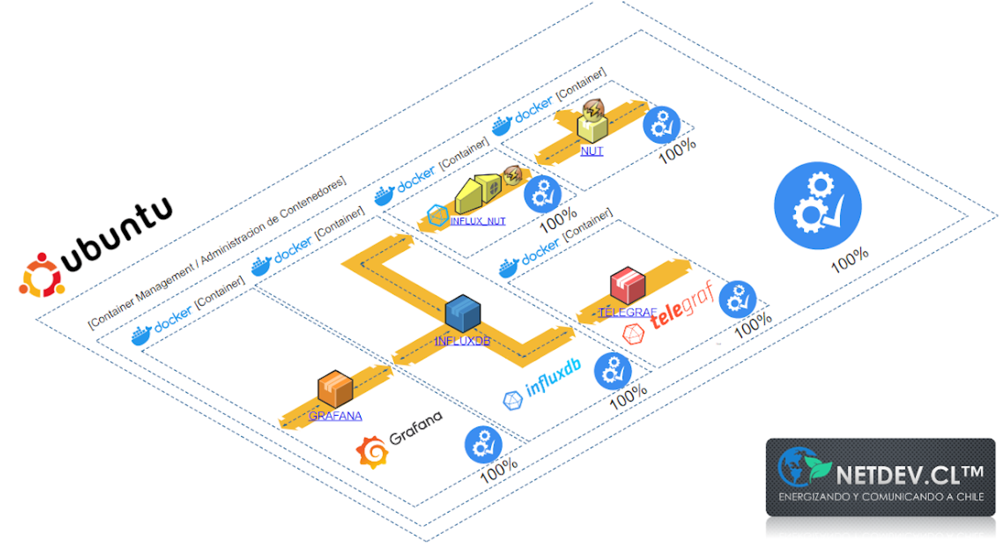

# Capturas de pantalla del sistema en ambiente productivo

## Vistas previas y diagramas _"as-built"_

### Rancher

La siguiente vista previa evidencia el despliegue y funcionamiento de plataforma Rancher en servidor de desarrollo RKE1, superando la arquitectura impuesta por el cliente. El desarrollo fue realizado con la finalidad de no modificar la arquitectura de recursos que tienen en su nuevo sistema de alta disponibilidad, el cual es un servidor de desarrollo de Rubin llamado Rancher/RKE1, tal fue solicitado vía correo electrónico. Los recursos de hardware entregados para ello fueron correctamente utilizados.

Imágen del _dashboard_ en funcionamiento dentro de Rancher/RKE1:

Arquitectura _"as-built"_ de lo recientemente descrito:

### Máq. virtual VSphere/VMware

Además, se cuenta con la instalación del sistema en su máquina virtual VSphere/VMware, fue realizada durante la instalación Rancher. Se utilizó la imagen VMware que desarrollada por NetDev para ustedes y que actualmente se encuentre funcionando en su servidor de producción de Rubin, con especial consideración respecto a la seguridad y la adaptabilidad del desarrollo.

Imágen del _dashboard_ en funcionamiento dentro de VSphere/VMware, junto a su respectiva arquitectura interna _"as-built"_:

### Micro-sistema de emergencia y pruebas de funcionamiento

## Imágenes de los recursos del _cluster_ en Rancher

### _Secrets_

### _PVCs_

### _ConfigMaps_

### _Services_

### _Pods_

**[Volver al README](/README.md)**
