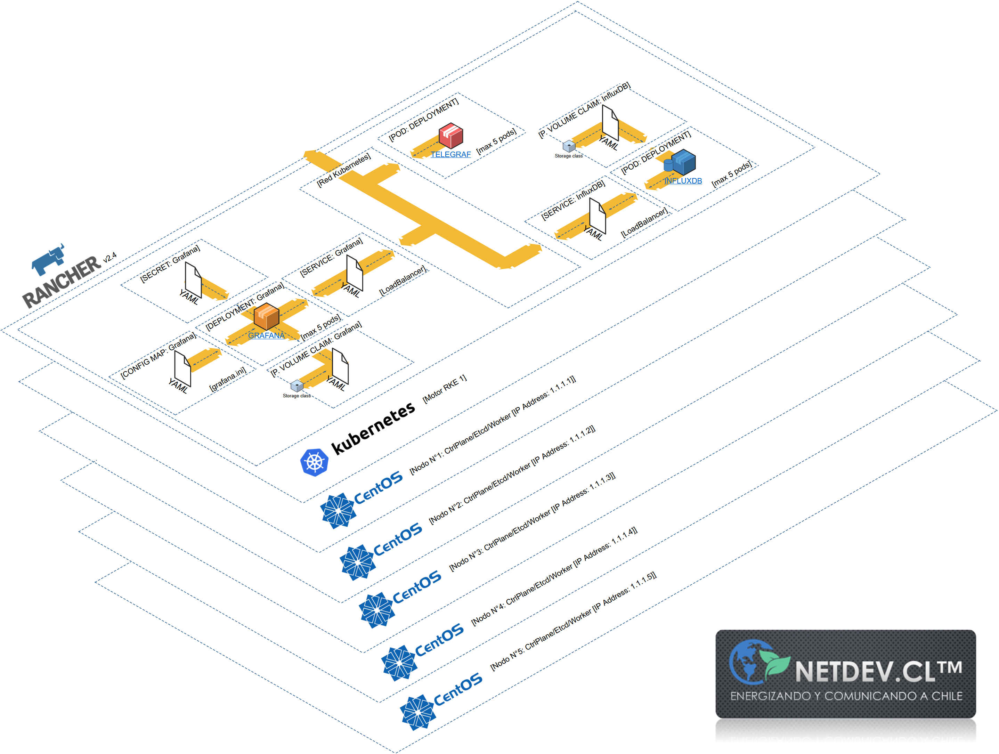

# Guía _Smart Grid_, monitoreo y alarma

| Versión | Descripción                       |
| ------- | --------------------------------- |
| 0.1     | Línea base                        |
| 0.2     | Se agrega historia del proyecto   |
| 0.3     | Se agregan diagramas _"as-built"_ |

> **La presente guía es parte de la base de conocimientos de NetDev**

## Vista previa de la solución y diagrama _"as-built"_

### Vista previa de la solución funcionando en ambiente productivo

Imagen del dashboard en funcionamiento dentro de Rancher/RKE1:

### Diagrama _"as-built"_ de la solución final funcionando en ambiente productivo

## Alcance

La guía tiene como propósito documentar el proyecto Smart Grid facilitando el entendimiento de la situación actual de la implementación, y como referencia en caso que se desee hacer mejoras, replicar o re-implementar.

Para consultar la historia del proyecto, hacer click [aquí](/Anexo03_01_Historia.md).

La guía se divide en 3 capítulos principales (descritos a continuación) y una serie de anexos (que se [encuentran más abajo](#anexos)). Se destaca, entre ellos, [la historia del proyecto](Anexo03_01_Historia.md)

Capítulos:

1.  [Introducción: Conceptos y esquema final general del proyecto _Smart Grid System_](/Cap1_PowerDevices.md).
2.  [Despliegue y configuración de plataforma _software_ de monitoreo](/Cap2_01_DespliegueApps.md).
3.  [Vista previa del sistema funcionando en producción y diagramas _"as-built"_](/Cap2_05_Imagenes.md).

## Resolución de problemas

En el siguiente enlace se encuentra un artículo con la lista de recomendaciones en caso de haber problemas con el proyecto en general. [Ir a Resolución de problemas](/ResolucionProblemas.md).

## Anexos

### Anexo I: Laboratorio Rancher

Corresponde a la documentación de labores de preparación de ambientes locales para pruebas de concepto, con fines de aprendizaje y experimentación, que se realizaron durante el proyecto.

1.  [Creación y preparación de las máquinas virtuales](/Anexo01_01_PreparacionMaquinasVirtuales.md).
2.  [Creación de un servidor _NFS_](/Anexo01_02_CreacionNFS.md).
3.  [Creación del _cluster_](/Anexo01_03_CreacionCluster.md).
4.  [Instalación de Rancher](/Anexo01_04_InstalacionRancher.md).
5.  [Configuración de Rancher](/Anexo01_05_ConfiguracionRancher.md).

### Anexo II: Tecnologías descartadaas durante el desarrollo del proyecto

Buscando el _stack_ de tecnologías apropiadas para la arquitectura general de la solución, NetDev intentó las siguientes soluciones:

1. [NUT](/Anexo02_01_NUT.md).
2. [SSMTP](/Anexo02_02_SSMTP.md).
3. [Archivo de configuración de red NetPlan](</configs/(deprecado)red.yml>).
4. [Antigua configuración de Telgraf](</configs/(deprecado)telegraf.conf>).
5. [Antigua definición del _dashboard_ en Grafana en formato JSON](/jsons/dashboard.json).

Hubo un antiguo _script_ de instalación para las primeras versiones de pruebas conceptuales. Se puede revisar [aquí](</scripts/(deprecado)script_instalacion.sh>).

### Anexo III: La historia del proyecto

Para consultar la historia del proyecto, hacer click [aquí](/Anexo03_01_Historia.md).

## Referencias utilizadas a lo largo de la guía:

- [1] [_Setting up a High-availability RKE Kubernetes Cluster_](https://docs.ranchermanager.rancher.io/how-to-guides/new-user-guides/infrastructure-setup/ha-rke1-kubernetes-cluster). Sitio web consultado el 12/12/2022.
- [2] [_OpenSSH Server_](https://ubuntu.com/server/docs/service-openssh). Sitio web consultado el 12/12/2022.
- [3] [_Install Docker Engine on Ubuntu_](https://docs.docker.com/engine/install/ubuntu/). Sitio web consultado el 12/12/2022.
- [4] [_RKE Kubernetes Installation_](https://rancher.com/docs/rke/latest/en/installation/) Sitio web consultado el 12/12/2022.
- [5] [_Install and Set Up kubectl on Linux_](https://kubernetes.io/docs/tasks/tools/install-kubectl-linux/) Sitio web consultado el 12/12/2022.
- [6] [_How to Install and Configure an NFS Server on Ubuntu 22.04_](https://linuxhint.com/install-and-configure-nfs-server-ubuntu-22-04/) Sitio web consultado el 14/12/2022.
- [7] [_Installing Helm_](https://helm.sh/docs/intro/install/) Sitio web consultado el 12/12/2022.
- [8] [_Setting up a High-availability RKE Kubernetes Cluster_](https://docs.ranchermanager.rancher.io/how-to-guides/new-user-guides/kubernetes-cluster-setup/rke1-for-rancher) Sitio web consultado el 12/12/2022.
- [9] [_Install/Upgrade Rancher on a Kubernetes Cluster_](https://docs.ranchermanager.rancher.io/pages-for-subheaders/install-upgrade-on-a-kubernetes-cluster) Sitio web consultado el 12/12/2022.
- [10] [_Deploy Grafana on Kubernetes_](https://grafana.com/docs/grafana/latest/setup-grafana/installation/kubernetes/) Sitio web consultado el 15/12/2022.
